  

  
  
  

---

## 📊 Contribution Graph

  

---

## 🔥 Streak Stats

  

---

## 📦 Featured Repositories

  
  

  
  

---

## 📈 GitHub Stats

  
  

  

  

---

## 🛠️ Tech Stack

  
  
  
  
  
  
  
  

---

## 🧠 AIOS — Adaptive Intelligence Operating System

```mermaid
flowchart TB
    subgraph CORE["🧠 AIOS CORE"]
        direction TB
        AF[/"🔄 Adaptive Framework"\]
        NI["🧬 Neural Intelligence"]
        IS["🛡️ Immune System"]
        MM["💾 Memory Matrix"]
    end
    
    subgraph SERVICES["⚡ Service Layer"]
        direction LR
        HTTP["🌐 HTTP Bridge"]
        WS["📡 WebSocket"]
        MCP["🔌 MCP Server"]
    end
    
    subgraph TOOLS["🔧 AI Tools (124+)"]
        direction LR
        T1["Code Analysis"]
        T2["Security Scan"]
        T3["Auto Healing"]
    end
    
    subgraph SECURITY["🔒 Security Layer"]
        direction LR
        AUTH["🔐 Auth"]
        CRYPT["🔏 Encryption"]
        AUDIT["📋 Audit"]
    end
    
    INPUT([" 📥 Input "]) --> SERVICES
    SERVICES --> CORE
    CORE --> TOOLS
    CORE --> SECURITY
    AF <--> NI
    NI <--> IS
    IS <--> MM
    TOOLS --> OUTPUT([" 📤 Output "])
    
    style CORE fill:#667eea,stroke:#764ba2,color:#fff
    style SERVICES fill:#00f5d4,stroke:#00b4d8,color:#000
    style TOOLS fill:#f72585,stroke:#b5179e,color:#fff
    style SECURITY fill:#4361ee,stroke:#3a0ca3,color:#fff
```

> **Enterprise AI infrastructure** with military-grade security and adaptive cognition.

<table align="center">
<tr>
<td align="center"><b>🧪 170</b> Security Tests</td>
<td align="center"><b>🛡️ 97.6%</b> Attack Resistance</td>
<td align="center"><b>🔧 124+</b> AI Tools</td>
<td align="center"><b>📦 769+</b> Python Modules</td>
<td align="center"><b>📊 15,847+</b> Lines of Code</td>
</tr>
</table>

<b>🔬 Key Features</b>

- **Adaptive Framework** — Self-optimizing task routing with context awareness
- **Neural Intelligence** — Pattern matching for predictive tool selection
- **Immune System** — Self-healing defenses with evolutionary learning
- **HTTP Bridge** — RESTful API gateway for seamless integrations

---

## 🌐 Connect

  <i>Building intelligent systems that adapt, evolve, and secure.</i>

  <a href="https://tecnocrat.github.io/Portfolio/">🌐 Portfolio</a> • 
  <a href="mailto:jesussard@gmail.com">📧 jesussard@gmail.com</a> • 
  <a href="https://www.linkedin.com/in/tecnocrat/">💼 LinkedIn</a>

---

  

